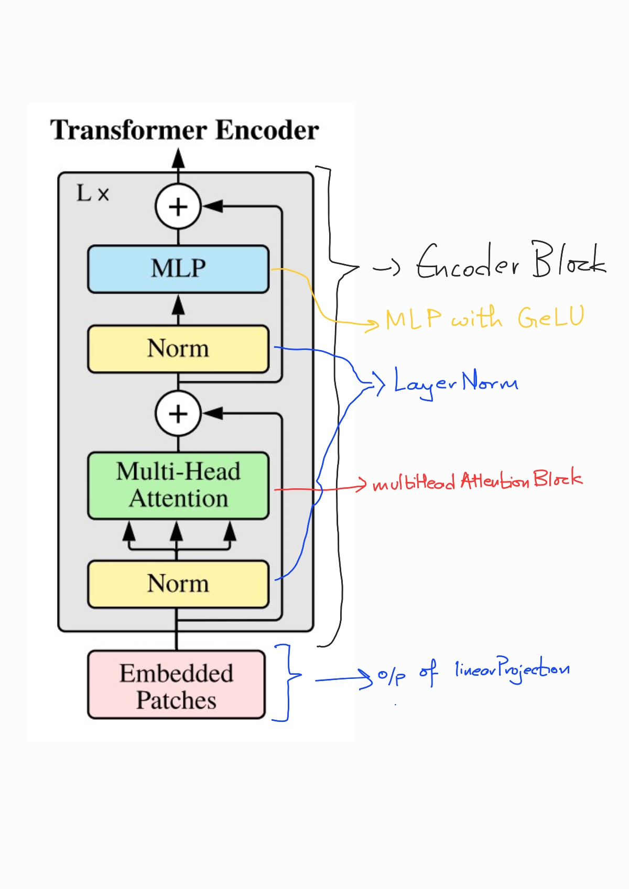
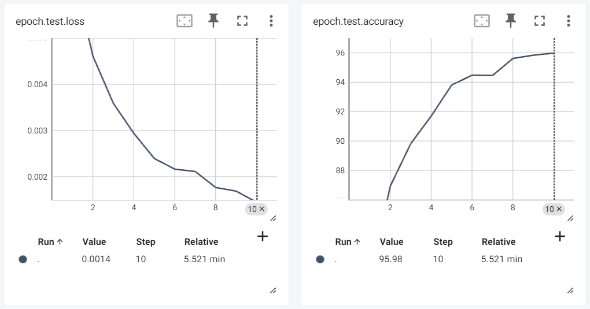

# vit-hands-on

Vision Transformer from scratch

This is an attempt to build the Vision Transformer architecture - A Transformer that has the capabilities of processing images from scratch. In this repo we

- Understand the basic ViT architecture
- Build each layer of the ViT step by step
- Write tests to ascertain expected model input and output shapes at the end of each step at different blocks in the transformer architecture
- Test our model on MNIST dataset and monitor the logs to tensorboard

## Understand the basic ViT architecture

After the release of [Attention is all you need](https://arxiv.org/pdf/1706.03762) paper, and it's wide success in the NLP world, researchers tried to adopt this paradigm and see if it works in the Computer Vision world. What came out as a result is this paper [An Image is worth 16 x 16 words: Transformers for Image Recognition at Scale](https://arxiv.org/pdf/2010.11929). 

The authors of this paper model an image as a sequence of patches by breaking it down into small chunks and then use the transformer architecture to process this information and ultimately yield a sequence of tokens which can be used to do downstream tasks like Image Classification, Image Segmentation, Object Detection etc. 

In this repository, I emulate the paper and build the architecture from scratch. Here is a run down of the different modules in the architecture and how they tie into the different modules in this repository

The above figure illustrates a overview of the architecture. The individual layers used are described below as follows

### linearProjection
Here we break the image into S x S patches and project them into a `d_model` dimensional space. To perform this operation optimally, I have used convolutional layer with stride = S, kernel_size = S. This ensures that the convolution operation acts as an MLP in each of the patches.

## attentionBlock
In this piece, I have implemented the basic attention block. Here we transform the incoming tokens each of `d_model` dimension space into `d_model // num_heads` space and compute the scaled dot product Attention inspired from the Attention is all you need paper. Since we use multi-head attention hence each head is transformed into a smaller dimensional space and eventually all the heads are concatenated to bring the representation back into the `d_model` space.

## multiHeadAttentionBlock
Here we use the attentionBlock from above and stack several of them together (precisely num_heads heads) and each head's attention is independent of the other. The intuition here is that each head is going to learn a different aspect of the ways in which the tokens relate or attend to each other similar to feature maps in CNNs. 

## encoderBlock
This is the core of the entire vision transformer. This block contains a Layernorm followed by a multiHeadAttentionBlock followed by another layernorm and a residual connection which is again normed and passed through an MLP with a residual connection from the output of multiheadAttentionBlock. Several of these blocks are stacked on top of one another to get the final model.

## vit
In Vision Transformer i.e. vit, there are two ways in which the output of the final layer can be used for classification
a. just like in BERT, use a CLS token which is a special token at the beginning of the sequence which is fed into an MLP to get the final dimensionalities as number of classes and softmax with cross entropy loss is applied on top of it.
b. Or use Global Average Pooling across all the tokens in the final encoder output and feed that to a classifier MLP

# Tests for model shapes

Some terms
- nc, w, h: Input Channels, Input Width, Input Height
- S: Patch Size
- B: Batch size
- Nseq: Sequence Length - w // S * h // S
- d_model: Dimensionality of the transformer
- nh: Number of heads in the encoder
- num_classes: Number of classes to be predicted

|**Layer**|**InputShape**|**Expected Output Shape**|
|--|--|--|
|linearProjection|(B, nc, w, h)|(B, Nseq, d_model)|
|attentionBlock|(B, Nseq, d_model)|(B, Nseq, d_model // nh)|
|multiHeadAttentionBlock|(B, Nseq, d_model)|(B, Nseq, d_model)|
|encoderBlock|(B, Nseq, d_model)|(B, Nseq, d_model)|
|vit|(B, nc, w, h)|(B, num_classes)|

# Results on MNIST dataset

The above classifier was evaluated using MNIST dataset and the results are logged to tensorboard. Here is a quick preview of the same but you can have a look at the detailed logs by running `tensorboard --logdir logs/` from the root of this repo after cloning it to have a detailed look at the results.

**Test-set Results**

